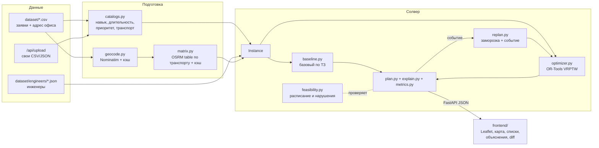

# Помощник диспетчера выездных инженеров

Решение кейса №13 хакатона ЛЦТ 2026 (заказчик — «Билайн Бизнес»).

Это веб‑прототип рабочего места диспетчера. Он распределяет заявки дня между выездными инженерами с учётом навыков, транспорта, смен и временных окон. Для каждого инженера строится маршрут (задача VRPTW), маршруты показываются на карте. Прототип перестраивает план после события в течение дня: срочной заявки, отмены или выбытия инженера. Результат объясняется языком диспетчера и сравнивается с базовым алгоритмом из ТЗ.

- **Алгоритм:** Google OR‑Tools (Routing) с иерархией целей «заявки → инженеры → километры», поэтапным решением и перепланированием с учётом стабильности плана.
- **Ограничения:** навык, транспорт, смена, окно. Все проверяются одним модулем, этот же модуль проверяет каждый готовый план (`violations`).
- **Расстояния и время:** по дорогам через OSRM, отдельно для автомобиля, велосипеда и пешехода. Для общественного транспорта используется модель поверх пешеходной сети. Без OSRM — упрощённый расчёт по координатам.
- **Интерфейс:** одна страница без сборки: FastAPI отдаёт статику, карта — Leaflet + OpenStreetMap.

---

## Содержание

1. [Быстрый старт](#1-быстрый-старт)
2. [Демонстрационный сценарий](#2-демонстрационный-сценарий)
3. [Схема решения](#3-схема-решения)
4. [Ограничения и как они проверяются](#4-ограничения-и-как-они-проверяются)
5. [Логика оптимизации](#5-логика-оптимизации)
6. [Перепланирование](#6-перепланирование)
7. [Объяснения](#7-объяснения)
8. [Метрики и сравнение с базовым вариантом](#8-метрики-и-сравнение-с-базовым-вариантом)
9. [Данные, справочники и допущения](#9-данные-справочники-и-допущения)
10. [Загрузка своих данных](#10-загрузка-своих-данных)
11. [API](#11-api)
12. [Структура репозитория и тесты](#12-структура-репозитория-и-тесты)
13. [Известные ограничения и развитие](#13-известные-ограничения-и-развитие)

---

## 1. Быстрый старт

### Вариант А — Docker (рекомендуется)

Нужен Docker с Compose v2.

```bash
docker compose up --build
```

Затем откройте **http://localhost:8000**.

Без Compose:

```bash
docker build -t lct-dispatcher .
docker run --rm -p 8000:8000 -v "$PWD/data:/app/data" lct-dispatcher
```

Параметры задаются переменными окружения:

| Переменная | По умолчанию | Назначение |
|---|---|---|
| `PORT` | `8000` | порт на хосте (`PORT=8080 docker compose up`) |
| `ROUTING` | `osrm` | `haversine` — считать расстояния без OSRM, по прямой с коэффициентом |

Тесты внутри контейнера:

```bash
docker compose run --rm app python -m pytest -q
```

### Вариант Б — локально (Python 3.12)

```bash
python3.12 -m venv .venv
.venv/bin/pip install -r requirements.txt
.venv/bin/uvicorn backend.app.main:app          # http://localhost:8000
```

### Первый запуск: нужен интернет, 5–7 минут

В репозитории нет координат и матриц расстояний: исходные данные содержат только адреса. При старте сервер прогревает все три участка в фоновом потоке:

1. Геокодирует около 200 адресов через Nominatim. Политика сервиса — 1 запрос в секунду, поэтому шаг занимает примерно 4 минуты.
2. Строит матрицы расстояний и времени через публичный OSRM (`routing.openstreetmap.de`) для каждого типа транспорта. Это ещё около 2 минут.

Результаты сохраняются в `data/`, который смонтирован в контейнер. Повторные запуски стартуют за секунды и работают без обращений к геокодеру и OSRM. Страница открывается сразу, но первый «Спланировать» ждёт окончания прогрева своего участка.

Прогреть кэши заранее, не запуская сервер:

```bash
.venv/bin/python -m scripts.prepare_data                         # локально
docker compose run --rm app python -m scripts.prepare_data       # в Docker
```

**Если OSRM недоступен** (сеть, лимиты), матрицы автоматически считаются по формуле из [§9.5](#95-время-и-расстояние-в-пути), в логе появляется «OSRM недоступен». Такие матрицы не кэшируются: при следующем запуске OSRM будет опрошен снова. Режим без OSRM можно включить и принудительно: `ROUTING=haversine`. Для геокодирования адресов интернет нужен в любом случае.

Карта в браузере загружает Leaflet с cdnjs и тайлы OpenStreetMap, поэтому браузеру тоже нужен интернет.

### Сравнение алгоритмов в консоли

```bash
.venv/bin/python -m scripts.compare --time-limit 15 -v     # все участки; -v — причины неназначения
.venv/bin/python -m scripts.compare vostok                  # один участок: vostok | yugo_vostok | yugo_centr
```

---

## 2. Демонстрационный сценарий

Шаги соответствуют §4 ТЗ.

1. **Данные.** Выберите участок в шапке: Восток, Юго‑восток или Югоцентр — это встроенные наборы организаторов. Кнопка загрузки (⬆) принимает свои CSV и JSON, см. [§10](#10-загрузка-своих-данных).
2. **Планирование.** Нажмите «Спланировать». Строятся два плана: базовый (§2.3 ТЗ) и оптимизированный. Поле «Лимит, с» задаёт бюджет оптимизатора, по умолчанию 30 с. Перепланирование берёт тот же лимит, но не больше 20 с.
3. **Карта.** На карте показаны цветные маршруты по инженерам, пронумерованные точки заявок и офис. Слева — список инженеров (заявки, км, смена, занятость) и список неназначенных заявок с причинами. Переключатель «Оптимизированный / Базовый» показывает любой из двух планов.
4. **Объяснение.** Нажмите на заявку в списке или на карте. Справа появятся назначенный инженер, проверенные ограничения, время прибытия и начала работы, а также почему выбран этот инженер, а не ближайшая альтернатива. Для неназначенной заявки справа показана причина.
5. **Событие.** Нажмите «+ Событие» или кнопку в карточке заявки или инженера и выберите тип: срочная заявка (адрес или точка на карте), отмена заявки или недоступность инженера. Задайте время события.
6. **Что изменилось.** План перестраивается с момента события. Старые маршруты показаны пунктиром, новые — сплошной линией. Справа перечислено, какие заявки сменили инженера, какие стали назначенными или неназначенными, у кого сдвинулось время, а также Δ км и Δ инженеров. Событие можно откатить.
7. **Сравнение с базовым.** Без выбранной заявки правая панель показывает таблицу «базовый vs оптимизированный»: задействованные инженеры, пробег по каждому инженеру и суммарно, число выполненных заявок.

---

## 3. Схема решения



- **Интерфейс** (`frontend/`): одна статическая страница (HTML, JS, CSS, Leaflet). Её раздаёт сам FastAPI, сборка и Node не нужны.
- **Backend** (`backend/app/`): FastAPI, Pydantic‑модели. Планы хранятся в памяти процесса до перезапуска, БД нет.
- **Алгоритмы** (`backend/app/solver/`): все алгоритмы получают один и тот же `Instance` и возвращают только **порядок заявок по инженерам**. Расписание (прибытие, ожидание, начало, конец, км) всегда пересчитывает `feasibility.py`, поэтому базовый и оптимизированный планы сравниваются по одинаковым правилам.
- **Данные** (`dataset/`, `data/`): CSV организаторов, справочник инженеров в git и кэши геокодера, матриц и линий. Кэши в git не хранятся.

---

## 4. Ограничения и как они проверяются

Все три группы обязательных ограничений ТЗ (§2.2) — жёсткие.

| Ограничение | Правило | Где |
|---|---|---|
| Квалификация | навык заявки входит в навыки инженера (у инженера от 1 до 3 навыков) | `feasibility.can_serve`, в OR‑Tools — через допустимые ТС узла |
| Время: окно | **начало работы** внутри окна заявки; приехать раньше можно (инженер ждёт), начать раньше нельзя | Time‑dimension: cumul узла = начало работы ∈ [начало окна, конец окна] |
| Время: смена | выезд не раньше начала смены; работа с учётом дороги и длительности заканчивается не позже конца смены | cumul старта и финиша инженера |
| Ресурс | если в заявке указан требуемый транспорт, он совпадает с транспортом инженера | `can_serve` |

Время в пути берётся по матрице **того транспорта, которым пользуется инженер**, поэтому пешеход и автомобилист доезжают до одной точки за разное время.

**Проверка результата.** Оптимизатор не формирует расписание сам. `simulate_route()` в `feasibility.py` заново считает маршрут каждого инженера, а `validate_plan()` дополнительно проверяет, что каждая заявка назначена не более одного раза. Найденные нарушения попадают в `plan.violations` и показываются в интерфейсе. На всех трёх участках у обоих алгоритмов 0 нарушений, это проверяют тесты.

Маршрут начинается в офисе участка (стартовая точка всех инженеров). Возврат в офис не требуется: маршруты открытые.

---

## 5. Логика оптимизации

### 5.1. Цели в порядке важности

Иерархия согласована с экспертами заказчика:

1. **Максимум выполненных заявок.** В первую очередь аварии, затем подключения и дозаказы, остальные — по остаточному принципу.
2. **Минимум задействованных инженеров**, то есть уникальных инженеров хотя бы с одной заявкой.
3. **Минимум суммарного пробега.**

Лексикографический порядок задаётся масштабом коэффициентов одной целевой функции:

| Уровень | Механизм OR‑Tools | Величина |
|---|---|---|
| Пропуск аварии / подключения / локальной заявки | `AddDisjunction` со штрафом | 10¹⁰ / 10⁹ / 10⁸ |
| Задействованный инженер | фиксированная стоимость ТС | 10⁶ |
| Задержка начала срочной заявки | мягкая верхняя граница cumul | 10⁴ за минуту |
| Пробег | стоимость дуги, метры по матрице транспорта инженера | ≈10⁵–10⁶ на весь план |

Штраф за пропуск заявки больше стоимости инженера, а стоимость инженера больше пробега любого маршрута. Поэтому оптимизатор не пожертвует заявкой ради экономии инженера и не возьмёт лишнего инженера ради километров.

### 5.2. Модель

- **Узлы:** офис (или индивидуальные точки старта при перепланировании), заявки и фиктивный узел конца с нулевой стоимостью, который делает маршруты открытыми.
- **Транспортные средства:** инженеры. У каждого свой транзитный callback по матрице своего типа транспорта.
- **Измерение времени:** транзит = время в пути + длительность работы. Ожидание (slack) разрешено. Окна и смены задаются диапазонами cumul.
- **Навык и транспорт:** для каждого узла заранее задан список допустимых инженеров.

### 5.3. Поиск

Стратегия — `PATH_CHEAPEST_ARC` → `GUIDED_LOCAL_SEARCH`.

- **Поэтапное решение.** При решении одной моделью поиск застревал: на Юго‑востоке оставалась невыполненной одна авария, хотя отдельно все аварии распределяются. Поэтому задача решается в три этапа: аварии и срочные → + подключения → все заявки. Каждый этап стартует с решения предыдущего. Бюджет: 60 % лимита на этапы (в пропорции 15/25/60 %), остаток — на «дожим».
- **Дожим числа инженеров.** Модель по одному исключает наименее загруженных инженеров и перерешивает задачу от текущего решения. Новое решение принимается, если число выполненных заявок не упало.
- **Страховка.** Если результат хуже базового алгоритма или стартового решения, модель перерешивает задачу от него (ещё до 20 % лимита, поэтому общее время может немного превысить лимит).

### 5.4. Базовый алгоритм (для сравнения)

Строго по §2.3 ТЗ (`solver/baseline.py`):

1. Заявки обрабатываются в порядке строк файла (порядок поступления).
2. Каждая заявка отдаётся **первому по списку** инженеру, которому она подходит по навыку и транспорту и у которого после добавления в **конец** маршрута не нарушается окно или смена.
3. Порядок посещения совпадает с порядком назначения. Глобальной оптимизации и вставки в середину маршрута нет.

---

## 6. Перепланирование

Поддерживаются все три события из ТЗ, у каждого есть момент времени T:

| Событие | Что происходит |
|---|---|
| **Срочная заявка** | Новая заявка приоритета «Срочная» с окном [T, конец дня] и штрафом за пропуск как у аварии. Задержка её начала штрафуется поминутно, поэтому она ставится как можно раньше. Координаты берутся из точки на карте или геокодируются по адресу. Расстояния до новой точки досчитываются через OSRM, остальная матрица не пересчитывается. |
| **Отмена заявки** | Снять можно только заявку, работа по которой ещё не началась. Если инженер уже ехал к ней, он освобождается в предыдущей точке в момент T. |
| **Инженер недоступен** | Инженер больше не получает заявок. Выполненное остаётся за ним. Текущую работу он доделывает или она возвращается в пул (флажок в форме). |

Как строится новый план:

1. **Заморозка на момент T.** Фиксируются выполненные заявки, заявка в работе (работа не прерывается — правило заказчика) и заявка, к которой инженер уже выехал. Инженер освобождается в точке последней зафиксированной заявки. Инженер без заявок ждёт в офисе с `max(T, начало смены)`.
2. **Перерешивание остального.** Используется тот же алгоритм, которым строился показанный план. У каждого инженера своя точка и время старта. Инженеров с выходного и вне смены не привлекаем.
3. **Стабильность.** Стартовое решение — остаток прежнего плана. Перенос заявки к другому инженеру штрафуется (3 км условного пробега), чтобы план не перетасовывался ради сотни метров.
4. **Diff.** Считается, какие заявки сменили инженера, какие появились или стали неназначенными, у кого сдвинулось время и как изменились км и число инженеров.

События можно применять последовательно: каждое следующее событие перепланирует уже перестроенный план.

---

## 7. Объяснения

Объяснения строятся по шаблонам, без LLM, и занимают 2–4 строки: заказчик просил коротко.

**Назначенная заявка** (`/api/plan/{id}/explain/{request_id}`):

```
Назначена: Петров С. (автомобиль; локальные, подключения, аварии), 3-я в маршруте
✓ навык «Работы на подключение и дозаказы» ✓ транспорт любой ✓ окно 14:00–16:00 — начало в 14:00 (приезд в 13:42, ждёт 18 мин)
Почему он: заявка добавляет в его маршрут +1.8 км. Ближайшая альтернатива — Смирнов Д., +6.4 км
```

Альтернатива вычисляется так: заявку пробуют вставить в лучшую позицию маршрута каждого другого подходящего инженера и сравнивают прирост км. Если у альтернативного инженера нет ни одной заявки, объяснение сообщает, что его пришлось бы вывести дополнительно.

**Неназначенная заявка.** Причины проверяются по порядку, выводится первая сработавшая:

1. «Нет инженера с навыком «Аварийные работы»».
2. «Нет инженера с навыком … и транспортом «Автомобиль»».
3. «Ни у одного подходящего инженера смена не покрывает окно 20:00–22:00».
4. «Не успевает: дорога от точки старта не меньше N мин…».
5. «Все подходящие инженеры (…) заняты в окне …».
6. «Можно поставить к …, но тогда не поместятся более важные заявки или понадобится лишний инженер» (приоритеты оптимизатора).
7. Для базового плана: «в конце маршрута уже стоят более поздние заявки, а вставлять в середину он не умеет».

**Маршрут инженера:** число заявок, км, время в пути, начало и конец работы, занятость смены.

**Сводка плана:** «Выполнено 62 из 66 (94%)». Если выполнено не всё, сводка жадно оценивает, сколько дополнительных инженеров и на какие смены нужно, чтобы закрыть остаток.

---

## 8. Метрики и сравнение с базовым вариантом

Для каждого плана считаются:

- **задействованные инженеры** — уникальные инженеры хотя бы с одной заявкой (обязательная метрика);
- **пробег** — км по каждому инженеру и суммарно по плану (обязательная метрика). Считается по матрице транспорта инженера от точки старта до последней заявки;
- выполненные заявки всего и по навыкам (аварии, подключения, локальные);
- км на выполненную заявку, время в пути, ожидание, занятость смены;
- число нарушений ограничений.

Результат `scripts.compare --time-limit 15` на встроенных данных (OSRM‑матрицы):

| Участок | Заявок / инженеров | Алгоритм | Выполнено | из них аварий | Инженеров | Пробег, км | км на заявку | Нарушений |
|---|---|---|---|---|---|---|---|---|
| Восток | 66 / 12 | базовый | 30 | 1 из 8 | 12 | 159.8 | 5.33 | 0 |
| | | **оптимизированный** | **62** | **8 из 8** | **11** | 202.5 | **3.27** | 0 |
| Юго‑восток | 83 / 15 | базовый | 47 | 1 из 12 | 14 | 545.6 | 11.61 | 0 |
| | | **оптимизированный** | **75** | **12 из 12** | 14 | 690.8 | **9.21** | 0 |
| Югоцентр | 56 / 10 | базовый | 24 | 0 из 1 | 10 | 125.5 | 5.23 | 0 |
| | | **оптимизированный** | **52** | **1 из 1** | **9** | 168.6 | **3.24** | 0 |

Как читать таблицу:

- Оптимизатор выполняет примерно **вдвое больше заявок** и **все аварии** тем же или меньшим числом инженеров.
- Суммарный пробег выше, потому что выполняется больше заявок. Пробег на одну выполненную заявку ниже на 20–40 %. Это следует из иерархии целей: невыполненная заявка важнее километров.
- Базовый алгоритм теряет заявки из‑за порядка файла. Строки в CSV не отсортированы по времени, и инженеру, получившему вечернюю заявку, уже нельзя добавить дневную в конец маршрута. Это и есть конфликт, при котором простое последовательное распределение даёт менее эффективный план (§6 ТЗ).
- Все заявки не выполняются ни одним алгоритмом, потому что в синтетических данных вечерние окна перегружены относительно 10–15 инженеров. Сводка плана подсказывает, каких инженеров и на какие смены не хватает.

Результаты OR‑Tools зависят от лимита времени и мощности машины, поэтому при повторном запуске числа могут немного отличаться.

---

## 9. Данные, справочники и допущения

### 9.1. Исходные данные

`dataset/` содержит данные организаторов на один рабочий день (17.08.2026): `vostok.csv`, `yugo_vostok.csv`, `yugo_centr.csv` — файлы «Синтетические данные» из кейса. Файлы «Контрольное распределение» лежат в `dataset/control/` без изменений. Это ручное распределение диспетчеров; организаторы запретили использовать его в расчётах, и код его не читает.

В `dataset/extra/` — выгрузки организаторов за другие дни, имя файла — участок и дата из самих заявок (у Югоцентра два файла за 28.09, второй — `_v2`). Они не входят во встроенные участки и открываются через загрузку своих данных ([§10](#10-загрузка-своих-данных)) с соответствующим участком‑основой: строки «Адрес офиса» в них нет. Колонка `Статус BK` (Выполнена/Отменена/В работе…) не учитывается — все заявки планируются как новые.

| Участок | Ключ | Заявок | Аварий | Инженеров | Особенности |
|---|---|---|---|---|---|
| Восток | `vostok` | 66 | 8 | 12 | есть колонка `Подключение` (FMC/FTTB) |
| Юго‑восток | `yugo_vostok` | 83 | 12 | 15 | выезды в Домодедово, Каширу, Ступино; 11 аварий с окном на весь день |
| Югоцентр | `yugo_centr` | 56 | 1 | 10 | — |

Участки — три изолированные задачи: инженер одного участка не берёт заявки другого.

**Формат CSV:** кодировка cp1251 (UTF‑8 при загрузке тоже принимается), разделитель `;`.

| Колонка | Смысл | Как используется |
|---|---|---|
| `Заявка` | ID | идентификатор; порядок строк — порядок поступления для базового алгоритма |
| `Тип заявки BK` | Локальная заявка / Подключение / Дозаказ / Глобальная проблема | → навык и приоритет |
| `Тип заявки HD` | подтип работ (Авария, Конвергенция абонента, Нет линка…) | → длительность и требуемый транспорт |
| `Начало`, `Окончание` | окно `DD.MM.YYYY HH:MM`, 2‑часовые слоты 10–22 | окно начала работ, минуты от 00:00 |
| `Район`, `Адрес` | адрес в свободной форме | геокодирование |
| `Гигабитное подключение` | Да/Нет | +15 мин к длительности |
| `Подключение` | FMC/FTTB (только Восток) | справочно |
| строка `Адрес офиса;…` в конце | офис участка | стартовая точка всех инженеров, это не заявка |

### 9.2. Единицы измерения

| Величина | Единица |
|---|---|
| время (окна, смены, прибытие) | минуты от 00:00 внутри системы, ЧЧ:ММ в интерфейсе |
| длительность работ, время в пути | минуты |
| расстояние, пробег | километры |
| координаты | широта и долгота WGS‑84 |

### 9.3. Справочники (ТЗ §2.4.1)

| Справочник | Значения (код — название) |
|---|---|
| Навык | 1 — Локальные работы; 2 — Работы на подключение и дозаказы; 3 — Аварийные работы |
| Транспорт | 1 — Автомобиль; 2 — Пешеход; 3 — Велосипед; 4 — Общественный транспорт |
| Приоритет | 1 — Обычная; 2 — Срочная |

### 9.4. Допущения: чего нет в данных

В исходных данных нет координат, длительностей, приоритетов, требуемого транспорта и инженеров. Все правила вывода собраны в `backend/app/catalogs.py`.

**Навык** (из `Тип заявки BK`): Локальная заявка → 1; Подключение, Дозаказ → 2; Глобальная проблема → 3.

**Длительность** (из `Тип заявки HD`, минуты):

| Тип HD | Мин |
|---|---|
| Авария | 120 |
| Заявка на подключение | 90 |
| Конвергенция абонента, Работа с кабелем | 60 |
| Заказ подключения/Дозаказ оборудования, Дозаказ оборудования, Переключение на Гбит/с, Нет линка, Разрывы, Рост ошибок на порту, Низкая скорость, IP‑адрес 169… | 45 |
| Замена роутера/приставки, TVE/ENT/ТВ ошибки | 30 |
| Информация, Мониторинг | 20 |
| прочие / пусто | 45 (для аварии — 120) |

Гигабитное подключение добавляет +15 мин.

**Приоритет.** Глобальная проблема (авария) — «Срочная», остальные — «Обычная». Внутри обычных подключения и дозаказы важнее локальных (штрафы в [§5.1](#51-цели-в-порядке-важности)).

**Требуемый транспорт — «Автомобиль»:**

- для аварий и работ с кабелем — нужно везти оборудование;
- для адресов за пределами Москвы (Домодедово, Кашира, Ступино и др.).

У остальных заявок требования к транспорту нет.

**Окна.** Окна из файла сохраняются как есть. Аварии с окном `00:01–23:59` — срочные на весь день: их нужно выполнить как можно раньше, но в пределах смены инженера. Аварии в обычных слотах планируются внутри слота.

**Инженеры** (`dataset/engineers/<участок>.json`, генерируются `data/synth.py`):

- 12 / 15 / 10 инженеров на участок, укладывается в диапазон ТЗ 10–15;
- состав берётся из фиксированного шаблона, а не случайно, чтобы гарантировать требования §6 ТЗ:
  - все три навыка и разные комбинации: универсалы {1,2,3}, {1,3}, {2,3}, {1,2}, {2}, {1};
  - все четыре типа транспорта, большинство на автомобиле и общественном транспорте;
  - смены 09:00–18:00, 10:00–19:00, 13:00–22:00, покрывающие окна 10–22;
  - на каждом участке несколько автомобилистов с аварийным навыком;
- от seed (по умолчанию 2026) зависят только ФИО и порядок в списке. Порядок важен для базового алгоритма;
- все стартуют из офиса участка, выходных в этот день нет;
- перегенерация: `python -m scripts.prepare_data --steps engineers [--seed N]`.

### 9.5. Время и расстояние в пути

| Транспорт | Источник | Время |
|---|---|---|
| Автомобиль | OSRM `routed-car` | время OSRM × 1.5 (OSRM не учитывает пробки) |
| Велосипед | OSRM `routed-bike` | время OSRM |
| Пешеход | OSRM `routed-foot` | время OSRM |
| Общественный транспорт | расстояние по пешеходной сети OSRM (бесплатного API для ОТ нет) | расстояние / 20 км/ч + 10 мин на ожидание и пересадки |

**Запасной вариант без OSRM:** расстояние = расстояние по прямой (haversine) × 1.35 (коэффициент извилистости). Скорости: автомобиль 25 км/ч, пешеход 4.5, велосипед 12, общественный транспорт 20 км/ч + 10 мин.

Линии маршрутов на карте берутся из OSRM `route` и на расчёт не влияют. Если сервис недоступен, рисуются прямые.

**Лимиты публичного OSRM.** Один запрос `/table` — не больше 100 × 100 клеток (`MAX_TABLE_CELLS`, иначе 400 TooBig) и URL до ~8 КБ (`MAX_URL_POINTS` = 300 точек, иначе 414). Участок до 100 узлов считается одним запросом на профиль. Больше — несколько прямоугольных запросов: строки блоками, столбцы целиком (например, 150 узлов — 3 запроса). Для новой срочной заявки на большом участке — два запроса: её строка и её столбец. Пешеход и общественный транспорт используют одну пешеходную таблицу, она запрашивается один раз. При 429, 5xx и обрыве соединения запрос повторяется дважды с паузами 2 и 5 с (`RETRY_DELAYS_S`). Если повторы не помогли, для этого профиля весь участок считается по haversine и не кэшируется.

### 9.6. Геокодирование

Адреса в данных записаны неоднородно, например «г.Город Москва, пр-кт.Волгоградский, д. 128 к 5» или «МО, г. Кашира Ленина ул. д. 9». `geo/address.py` нормализует их, а `geo/geocode.py` запрашивает Nominatim, ограничивая поиск рамкой Москвы и области. Если адрес не найден, используется цепочка запасных вариантов: дом → улица → район → город. Точность сохраняется в `geo_quality` (`exact` / `street` / `approx`), приблизительные координаты помечены в интерфейсе.

Кэш — `data/geocode_cache.json`. Его можно править вручную: записи с `"manual": true` не перезаписываются.

---

## 10. Загрузка своих данных

Кнопка ⬆ в шапке вызывает `POST /api/upload` и создаёт участок, который живёт до перезапуска сервера. Можно загрузить что‑то одно — недостающее берётся из выбранного «участка‑основы».

**Заявки — CSV** в формате организаторов, до 150 заявок.

- Обязательные колонки: `Заявка`, `Тип заявки BK`, `Начало`, `Окончание`, `Адрес`.
- Необязательные: `Тип заявки HD`, `Район`, `Гигабитное подключение`, `Подключение`.
- Офис задаётся строкой `Адрес офиса;<адрес>` в конце, полем формы или берётся у участка‑основы.
- Готовые примеры — выгрузки за другие дни в `dataset/extra/` (офиса в них нет — выберите участок‑основу).
- Новые адреса геокодируются примерно по 1 с на адрес. Заявки, которые не удалось геокодировать, пропускаются с предупреждением.

**Инженеры — JSON‑массив** (как в `dataset/engineers/*.json`):

```json
[
  {"id": "E01", "name": "Егоров Н.", "shift_start": "10:00", "shift_end": "19:00", "skills": [1, 2], "transport": 3}
]
```

Смена задаётся строкой `"ЧЧ:ММ"` или минутами от 00:00. `skills` — от 1 до 3 кодов навыков, `transport` — код транспорта ([§9.3](#93-справочники-тз-241)). Если файла инженеров нет и участок‑основа не выбран, инженеры берутся из шаблона `synth.py`.

**Событие перепланирования** передаётся через `POST /api/replan`, из интерфейса — формой «+ Событие»:

```json
{"plan_id": "…", "event": {"type": "urgent", "time": 780, "address": "Москва, ул. Земляной Вал, д. 24", "type_bk": "Глобальная проблема", "type_hd": "Авария"}}
{"plan_id": "…", "event": {"type": "cancel", "time": 720, "request_id": "307713418"}}
{"plan_id": "…", "event": {"type": "unavailable", "time": 840, "engineer_id": "E03", "finish_current": true}}
```

Для срочной заявки вместо `address` можно передать `location: {"lat": …, "lon": …}`, а `duration` — если длительность нужна отличная от справочной.

---

## 11. API

Все эндпоинты возвращают время в минутах от 00:00, расстояния — в км. Интерактивная документация: http://localhost:8000/docs.

| Метод | Путь | Назначение |
|---|---|---|
| GET | `/api/areas` | участки: название, число заявок и инженеров |
| GET | `/api/areas/{area}/data` | заявки, инженеры, офис с координатами |
| POST | `/api/upload` | свой участок из CSV/JSON (multipart: `requests`, `engineers`, `base_area`, `name`, `office_address`) |
| POST | `/api/plan` | `{area, algorithm: "optimized" \| "baseline", time_limit}` → план (`time_limit` по умолчанию 30 с) |
| POST | `/api/replan` | `{plan_id, event, time_limit}` → новый план и diff (`time_limit` по умолчанию 20 с) |
| GET | `/api/plan/{id}` | план |
| GET | `/api/plan/{id}/compare/{other}` | сравнение метрик двух планов |
| GET | `/api/plan/{id}/diff/{other}` | что изменилось между планами |
| GET | `/api/plan/{id}/explain/{request_id}` | объяснение по заявке |
| GET | `/api/plan/{id}/geometry` | линии маршрутов по дорогам |

План соответствует §2.4.2 ТЗ:

- `routes` — для каждого инженера упорядоченные остановки (`arrival`, `start`, `end`, `wait`, `leg_km`), км и объяснение маршрута;
- `unassigned` — неназначенные заявки с причинами;
- `metrics` — число инженеров, км по каждому и суммарно, выполненные по навыкам;
- `violations` — нарушения ограничений (пустой список);
- `summary` — сводка плана.

---

## 12. Структура репозитория и тесты

```
backend/app/
  main.py            FastAPI: API + раздача frontend/, прогрев кэшей при старте
  catalogs.py        справочники и все правила вывода атрибутов заявки
  models.py          Pydantic-модели (время — минуты, расстояние — км)
  data/              чтение CSV, синтез инженеров, загрузка своих файлов
  geo/               разбор адресов, Nominatim, матрицы OSRM, линии маршрутов
  solver/            instance, feasibility, baseline, optimizer, replan, explain, metrics, plan
frontend/            index.html, app.js, style.css (Leaflet)
dataset/             <участок>.csv — заявки организаторов; engineers/<участок>.json — справочник инженеров;
                     control/ — контрольное распределение (не используется); extra/ — выгрузки за другие дни
data/                кэши (не в git, создаются автоматически)
scripts/             prepare_data.py — прогрев кэшей; compare.py — сравнение в консоли
tests/               pytest: данные, солвер, перепланирование, API, линии
```

```bash
.venv/bin/python -m pytest -q                                   # все тесты (~15 с на солвер)
.venv/bin/python -m pytest "tests/test_data.py::test_load_area[vostok]"
```

Тесты проверяют:

- разбор CSV и вывод атрибутов;
- 0 нарушений у обоих алгоритмов на всех участках;
- что оптимизатор не хуже базового;
- все три типа событий, заморозку и стабильность при перепланировании;
- API.

Тестам нужны прогретые кэши в `data/`. С пустым `data/` при первом прогоне они сами обращаются к Nominatim и OSRM.

---

## 13. Известные ограничения и развитие

**Ограничения прототипа**

- **Зависимость от публичных сервисов.** Nominatim (1 запрос/с) и `routing.openstreetmap.de` (лимиты, ответы до 10 с, не более 100 × 100 клеток и ~300 точек в запросе — большие загруженные участки считаются несколькими запросами, [§9.5](#95-время-и-расстояние-в-пути)) нужны для первого запуска и для срочных заявок с новым адресом. Без них расстояния считаются упрощённо, а новый адрес без точки на карте не геокодируется.
- **Точность геокодирования.** Часть адресов находится только до улицы или района (`geo_quality`). Ошибка координат переходит во время в пути.
- **Время в пути** не учитывает время суток. Пробки заменены постоянным коэффициентом 1.5 для автомобиля, общественный транспорт смоделирован формулой.
- **Синтетические допущения.** Длительности работ, требуемый транспорт и справочник инженеров придуманы командой ([§9.4](#94-допущения-чего-нет-в-данных)). На реальных данных их нужно заменить справочниками заказчика.
- **Упрощение перепланирования.** Инженер, выехавший к заявке, её доделывает: развернуть его в пути нельзя.
- **Хранение в памяти.** Планы и загруженные участки хранятся в памяти одного процесса и пропадают при перезапуске. Многопользовательской работы нет.
- **Эвристика.** OR‑Tools не доказывает оптимальность. Результат зависит от лимита времени и мощности машины.
- **Нет ручного переназначения** заявки перетаскиванием. Учёта оборудования нет.

**Идеи развития**

- Собственный OSRM/GraphHopper с профилем ОТ и историческими скоростями по часам. Прогноз опозданий с мягкими окнами (в модели уже есть механизм мягких границ).
- Ручное переназначение с мгновенной проверкой ограничений и пересчётом расписания.
- Цепочка событий в течение дня с журналом и сравнением «план на утро vs факт».
- Учёт оборудования и склада, обеды и перерывы, возврат в офис, несколько дней.
- Хранение планов в SQLite/PostgreSQL, интеграция с FSM‑системой заказчика.
